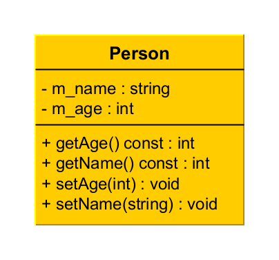

# Encapsulation (Kapsülleme)

Kapsülleme, bir programlama dilinde bir sınıfın içerisinde bulunan öğeleri (örneğin, değişkenler ve fonksiyonlar) gizlemek ve bu öğelerin kullanımını sınırlandırmak için kullanılan bir programlama konseptidir. Kapsülleme, bir sınıfın içerisinde bulunan öğeleri sadece belirli koşullar altında erişilebilir hale getirir ve bu sayede sınıfın dışarıdan korunmasını sağlar. Bu sayede, sınıfın içeriği değiştirilmesinden veya kullanımından kaynaklanabilecek hatalar engellenir ve sınıfın çalışması güvenli bir şekilde sağlanır. Dışarıdan yapılan risk teşkil eden müdaheleler algılabilir ve engellebilir. ATM örneğini düşündüğünüzde kullanıcının hesabından olmayan miktarda para çekmek istemesi buna bir örnektir.

Kapsülleme, C++ dilinde "private", "protected" ve "public" anahtar kelimeleri kullanılarak gerçekleştirilebilir. Bir sınıfın verilerini ve işlevlerini saklamak için "private" erişim belirleyicisini kullanır. Bu erişim belirleyicisi, sınıfın içerisinde bulunan öğeleri saklar ve bu öğeleri dışarıdan erişilemez ve değiştirilemez hale getirir. Ancak, sınıf içerisinde bulunan bu öğeleri kullanmak için "public" erişim belirleyicisi kullanılır. "Public" erişim belirleyicisi, sınıfın içerisinde bulunan öğeleri kullanılabilir hale getirir ve bu sayede sınıfın içerisinde bulunan veriler ve işlevler kullanılabilir ve programın çalışması sağlanabilir.

Örneğin, aşağıdaki kod parçacığında "Person" adında bir sınıf tanımlanmıştır ve bu sınıf içerisinde "m_name" ve "m_age" adında iki adet string ve integer türünden değişken bulunmaktadır.

Sınıf değişkenlerinin adlarına "m_" ön eki eklenmiştir ve bu ön ek "member" kelimesinin kısaltılmış halidir ve bu sayede bu değişkenlerin sınıf içerisinde bulunan değişkenler olduğu anlaşılmaktadır. Dışarıdan parametre olarak gelen değişkenlere ise "t_" ön eki eklenmiştir. Bu ön ek "the" kelimesinin kısaltılmış halidir. Bu sayede hangi değişken sınıf üyesi hangi değişken parametre çok rahat bir şekilde ayırt edilebilir bir hale getirilmiştir. Ayrıca, "setName()" ve "setAge()" fonksiyonlarının adlarına "set" ön eki eklenmiştir ve bu ön ek "setter" kelimesinin kısaltılmış halidir ve bu sayede bu fonksiyonların değişkenlerin değerlerini ayarlamak için kullanıldığı anlaşılabilir. Benzer şekilde, "getName()" ve "getAge()" fonksiyonlarının adlarına "get" ön eki eklenmiştir ve bu ön ek "getter" kelimesinin kısaltılmış halidir ve bu sayede bu fonksiyonların değişkenlerin değerlerini döndürmek için kullanıldığı anlaşılabilir. Bu tür düzenlemeler programlamada okunurluğu ve anlaşırlığı arttırmaktadır.

~~~C++

    /**
     * @file Encapsulation.cpp
     * @author Hakan CERAN
     * @date 07.12.2022
     * @brief Encapsulation Example Code
     * @note Good
     */

    #include <iostream>
    #include <string>
    #include <clocale>
    #include <utility>

    using namespace std;

    // Person sınıfı tanımı.
    class Person {
        private:
            // İsim değişkeni.
            string m_name{};
            
            // Yaş değişkeni.
            int m_age{};

        public:
            // İsim değişkeninin değerini ayarlayan fonksiyon.
            void setName(string t_name) {
                m_name = std::move(t_name);
            }

            // Yaş değişkeninin değerini ayarlayan fonksiyon.
            void setAge(int t_age) {
                // Yaş değişkeninin değeri 0'dan büyük ve 120'den küçük olmalıdır.
                if (t_age > 0 && t_age < 120) {
                    // Eğer koşul sağlanıyorsa yaş değişkenine değer atanır.
                    m_age = t_age;
                } else {
                    // Koşul sağlanmıyorsa bir hata mesajı yazdırılır.
                    cout << "Hata: Geçersiz yaş değeri!" << endl;
                }
            }

            // İsim değişkeninin değerini döndüren fonksiyon.
            string getName() const {
                return m_name;
            }

            // Yaş değişkeninin değerini döndüren fonksiyon.
            int getAge() const {
                return m_age;
            }
    };

    int main() {
        // Türkçe karakterlerin kullanılabilmesi için dil ayarları yapıldı.
        setlocale(LC_ALL, "Turkish");

        // Arkaplan ve yazı rengi ayarları yapıldı.
        system("color f9");

        // Person nesnesi oluşturulur.
        Person person;

        // İsim değişkenine değer atanır.
        person.setName("Hakan CERAN");

        // Yaş değişkenine değer atanır.
        person.setAge(30);

        // İsim değişkeninin değeri ekrana yazdırılır.
        cout << "İsim: " << person.getName() << endl;

        // Yaş değişkeninin değeri ekrana yazdırılır.
        cout << "Yaş: " << person.getAge() << endl;
        
        // system("PAUSE");
        
        return 0;
    }

~~~

Bu kod parçacığında, değişkenler ("m_name" ve "m_age") "private" erişim belirleyicisi ile tanımlanmıştır ve bu sayede sınıfın dışarısından erişilemez ve değiştirilemez. Ancak, bu değişkenler sınıfın içerisinde kullanılabilir ve bu değişkenlerin değerlerini ayarlamak için "setName()" ve "setAge()" fonksiyonları, değerlerini okumak için de "getName()" ve "getAge()" fonksiyonları tanımlanmıştır. Bu fonksiyonlar da "public" erişim belirleyicisi ile tanımlanmıştır. "setAge()" fonksiyonu içerisinde yaş değişkeninin değerinin 0'dan büyük ve 120'den küçük olması kontrol edilmiştir. Eğer bu koşul sağlanıyorsa yaş değişkenine değer atanır. Ancak koşul sağlanmıyorsa bir hata mesajı yazdırılmıştır ve geçersiz yaş değerlerinin girilmesine engel olunmuştur. Bu sayede sınıfın içerisinde bulunan veriler ve işlevler güvenli bir şekilde korunmuş ve kapsülleme konsepti gerçekleştirilmiştir.
